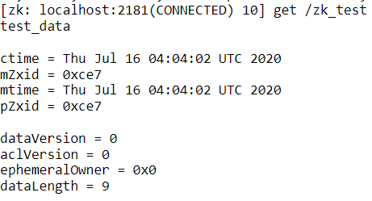
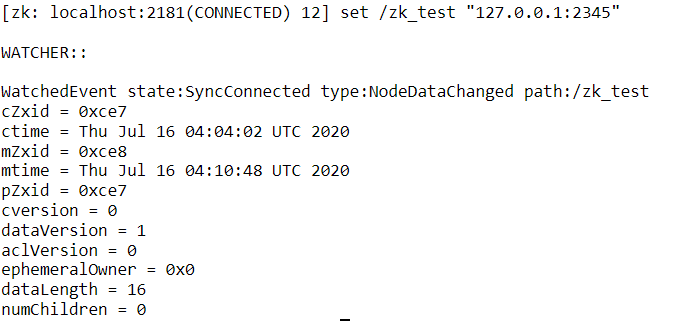

# Zookeeper - keep your zoo tidy

Reference: [http://www.corejavaguru.com/bigdata/zookeeper/cli](http://www.corejavaguru.com/bigdata/zookeeper/cli)

Zookeeper Client provide Command Line Utilities for us to play us. Let's run it in our virtual machine \(Hortonworks Sandbox\) 

Cli execution is located at /usr/hdp/current/zookeeper-client/bin

```bash
cd /usr/hdp/current/zookeeper-client/bin
./zkCli.sh
```

Once you're done, you will see the followings. You can now freely explore ZooKeeper utilities:

list out all znodes

```bash
/ls
#[registry, cluster, controller, brokers, storm, zookeeper, infra-solr, hbase-unsecure, admin, isr_change_notification, log_dir_event_notification, templeton-hadoop, hiveserver2, controller_epo
#ch, druid, consumers, latest_producer_id_block, config] 
```

Create a new Znode

```bash
 create /zk_test test_data
```

Get zk\_test Znode

```bash
get /zk_test
```



Set up a watcher to zk\_test

```bash
get /zk_test 1
```

edit the data associated with zk\_test

```bash
set /zk_test "127.0.0.1:2345"
```



Finally, delete the node.

```bash
delete /zk_test
```

